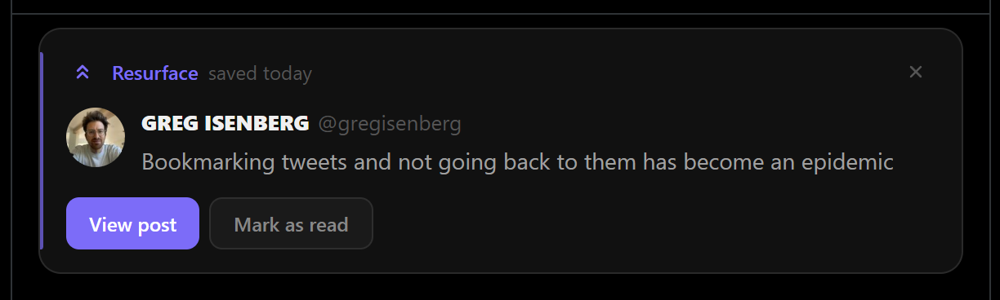
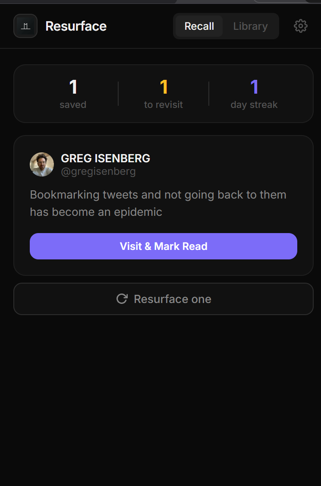
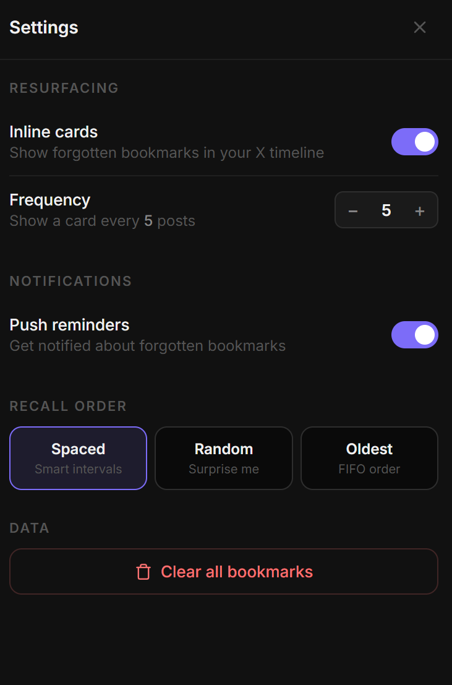

<h1 align="center">
   
  Resurface for X
</h1>

  <strong>Your forgotten bookmarks come back to haunt you.</strong> 
  Never lose a saved post again.

  
  
  

 

  

---

## What is Resurface?

> *"Bookmarking tweets and not going back to them has become an epidemic"* — [@gregisenberg](https://x.com/gregisenberg/status/2061835266587869404)

You bookmark a post on X. You never see it again.

**Resurface fixes that.** It quietly tracks every post you bookmark and brings them back to you — inline in your timeline, as push notifications, and through smart spaced repetition — so nothing you saved ever goes to waste.

Think of it as a second brain for your X bookmarks.

---

## Features

- **👻 Ghost Cards** — Forgotten bookmarks surface inline as you scroll your X timeline, right where you'd least expect them
- **🧠 Spaced Repetition** — Smart scheduling resurfaces posts at increasing intervals so they actually stick
- **🔔 Push Reminders** — Browser notifications remind you about bookmarks you've ignored for too long
- **📚 Library View** — Browse, search, and manage all your saved posts in one place
- **⚡ Instant Save Toast** — Subtle confirmation the moment you bookmark something
- **⚙️ Fully Configurable** — Control frequency, recall order (Spaced / Random / Oldest), and notifications

---

## Screenshots

<table>
  <tr>
    <td align="center">
       
      <b>Recall View</b>
    </td>
    <td align="center">
       
      <b>Inline Ghost Card</b>
    </td>
    <td align="center">
       
      <b>Settings</b>
    </td>
  </tr>
</table>

---

## Installation

> The extension is not yet on the Chrome Web Store. Install it manually in developer mode.

1. Clone or download this repository
2. Open Chrome and go to `chrome://extensions`
3. Enable **Developer mode** (top right toggle)
4. Click **Load unpacked** and select the `x_bookmarks` folder
5. Pin the extension and navigate to [x.com](https://x.com)

---

## How It Works

1. **Bookmark any post on X** — Resurface intercepts the click and saves it locally (no account, no server)
2. **Scroll your timeline** — Every few posts, a ghost card appears showing something you saved and forgot
3. **Get reminded** — Push notifications fire periodically with a forgotten bookmark to revisit
4. **Mark as read** — Once you've revisited a post, mark it read; the spaced repetition algorithm schedules its next appearance

All data is stored locally in `chrome.storage.local`. Nothing leaves your browser.

---

## Tech Stack

- **Manifest V3** Chrome Extension
- Vanilla JS — no frameworks, no build step
- `chrome.storage.local` for all persistence
- `chrome.alarms` + `chrome.notifications` for background reminders
- `IntersectionObserver` + `MutationObserver` for timeline injection

---

## License

This project is source-available under the [Business Source License 1.1](LICENSE).

- ✅ Free for personal, non-commercial use
- ✅ Source code is readable and auditable
- ❌ Commercial use requires a separate license from the author
- 🔓 Converts to [MIT](https://opensource.org/licenses/MIT) on **January 1, 2030**

© 2024 [mxxfun](https://github.com/mxxfun). All rights reserved.
